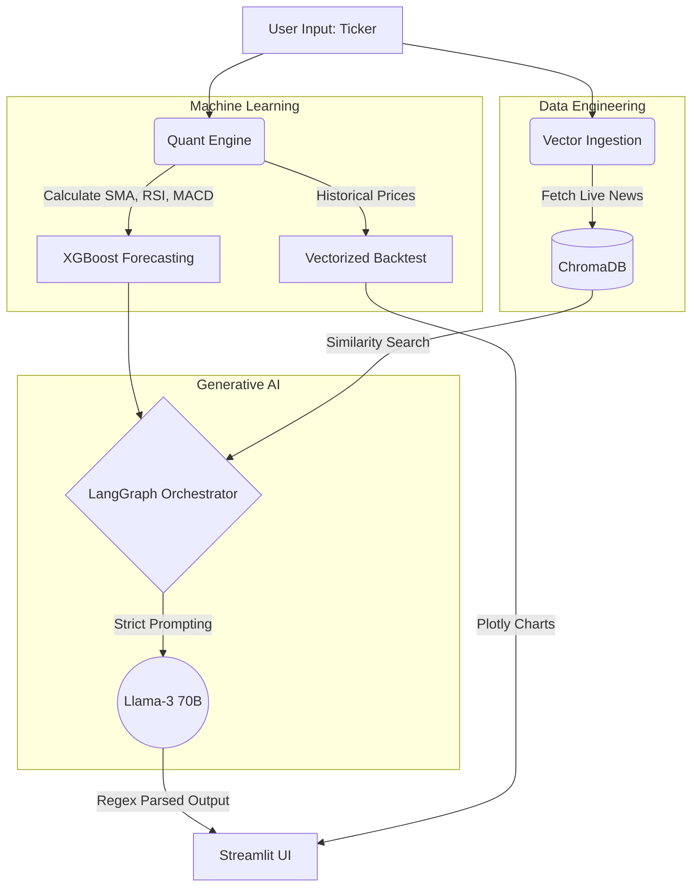

# 📈 FinSight Pro: Autonomous AI Financial Analyst

[](https://finsight-investment-analyst.streamlit.app/)
[](https://github.com/pankrulez/finsight-ai/actions)
[](https://www.python.org/)

**FinSight Pro** is an end-to-end, multi-agent financial intelligence platform. It bridges the gap between raw quantitative data and accessible financial literacy by combining **Machine Learning (XGBoost)**, **Vector Retrieval (ChromaDB)**, and **Generative AI (Llama-3 via Groq)** into a seamless, cloud-deployed dashboard.

Unlike simple wrappers, FinSight acts as a fully autonomous research analyst. It triangulates technical price action, live market news, and statistical momentum to generate both professional-grade investment memos and "Explain Like I'm 5" (ELI5) translations for non-technical users.

---

## 🚀 Enterprise-Grade Features

* **🤖 LangGraph Multi-Agent Architecture:**
    * **Quant Node:** Calculates real-time RSI, MACD, Moving Averages, and ATR.
    * **RAG Node:** Embeds and retrieves live company profiles and Yahoo Finance news using `all-MiniLM-L6-v2`.
    * **Manager Node:** Uses **Llama-3-70b** with strict regex-parsing to synthesize data into perfectly formatted Markdown reports.
* **🧠 On-Demand Machine Learning:**
    * Features a cloud-executable ML pipeline that fetches 10 years of historical data, engineers features, and dynamically retrains an **XGBoost Regressor** to forecast the next closing price.
* **📊 Dual-Persona Insights:** * Automatically generates a strict Wall Street Strategic Memo alongside a jargon-free "Beginner Translation" of the metrics.
* **📈 Vectorized Strategy Backtesting:** * Simulates historical algorithmic trading (e.g., SMA Crossovers) vs. standard Buy & Hold strategies, outputting plain-English profit comparisons.
* **⚙️ CI/CD & MLOps:** * Fully automated testing pipeline using **Pytest** and **GitHub Actions** to ensure feature engineering math remains stable before deployment.

---

## 🏗️ System Architecture



    ---

## 🛠️ Tech Stack
- **LLM & Orchestration**: LangChain, LangGraph, Groq API (Llama-3).

- **Machine Learning**: XGBoost, Scikit-Learn, Pandas.

- **Vector Database**: ChromaDB, HuggingFace Sentence Transformers.

- **Frontend UI**: Streamlit, Custom HTML/CSS Metric Cards, Plotly.

- **DevOps**: GitHub Actions, Pytest.

---

## ⚡ Quick Start (Local Development)
1. Clone the Repository

```Bash
git clone [https://github.com/pankrulez/finsight-ai.git](https://github.com/pankrulez/finsight-ai.git)
cd finsight-ai
```

2. Set Up Environment Variables
Create a .env file in the root directory and add your Groq API key:

```Plaintext
GROQ_API_KEY=gsk_your_free_key_here
```

3. Install Dependencies

```Bash
pip install -r requirements.txt
```

4. Run the Application

Start the Streamlit server. The application will handle database ingestion and ML training dynamically via the UI.

```Bash
streamlit run app.py
```

## 🧪 Automated Testing
This project utilizes continuous integration. To run the Pytest suite locally and verify the feature engineering math:

```Bash
pytest tests/
```

---

## 📄 License
This project is licensed under the MIT License - see the LICENSE file for details.